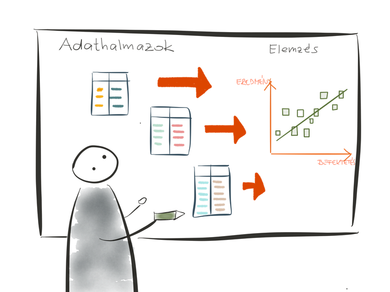
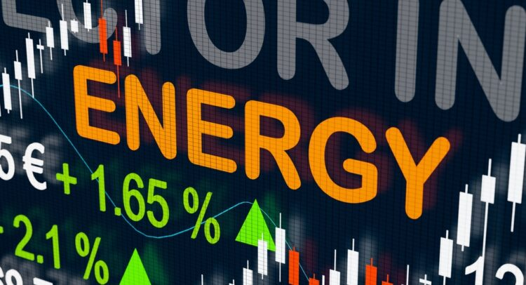

# Kaggle Challenges

A collection of data science and machine learning Kaggle challenges

### [Energy Stock Investments](./energy-stock-investments/README.md)

A correlation analysis between the volatility of energy stocks and their trading volume

