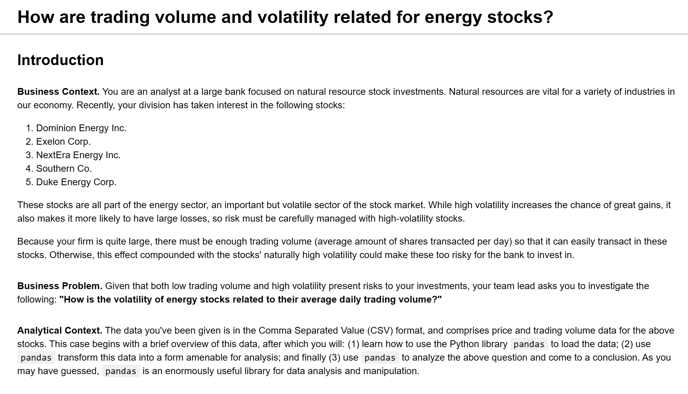

  

# Energy Stock Investments

### A correlation analysis between the volatility of energy stocks and their average daily trading volume

  

  

    
  

  

---

## Source Code

- [EDA (Exploratory Data Analysis)](notebooks/energy-stock-investments.ipynb)

## Data

- [Raw](../energy-stock-investments/data/raw/)
- [Processed](../energy-stock-investments/data/processed/energy-stocks-combined.csv)
- [Results](../energy-stock-investments/data/results/energy-stocks-results.csv)

---

## Analysis Results

A moderately strong positive correlation was discovered between the volatility of energy stocks and their average daily trading volume suggesting:

- As trading volume increases, there is a tendency for volatility to increase as well, and vice versa
- The volatility of energy stocks is estimated to have a moderately strong positive correlation to their average daily trading volume
- During periods of high volatility, increased trading activity could be anticipated, influencing risk management decisions

It is important to note that financial markets are complex and the relationships found between variables are often influenced by various factors. While this linear correlation is estimated to be significant, there might still be non-linear or indirect relationships not captured by the correlation coefficient. Other market indicators, economic events, and additional external factors should also be considered for a comprehensive analysis. ❤️ 📊
